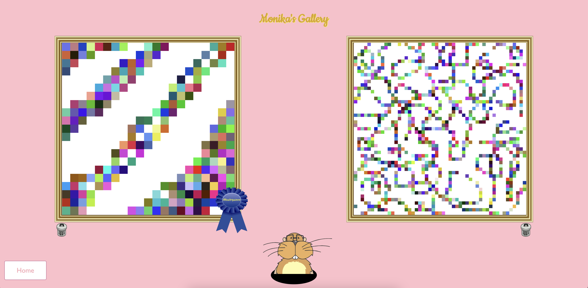

# Sketchpad

Live Site: https://monikachris.github.io/sketchpad/

Pixel-Sketch allows you to produce digital etch-a-sketch-style creations and save them
to your user gallery.
To create an account, click "Register" and enter your username.
Next click "Login" and enter your username to access your account.
Hover your mouse over the pixel-sketch to draw. You can change colors using the
bottom left button, and you can change the pixel resolution by adjusting the slider.
When you're finished, click "Save." You can save up to two artworks.
To view your artworks, click "My Gallery."
Once you've saved 2 artworks, you can wake the gopher by clicking on his burrow, and
he will pop up to select his favorite. If you try clicking the gopher's burrow before
2 creations are present for him to judge, you will see him snoozing.
To delete an artwork, click the trash icon below the frame.
To permanently delete your user account, click "Delete Account" on the homepage and
follow the prompt to confirm.

## Live Site Images

Photo Credits:
1. Wooden Desk (background photo)
Photo by Yasemin K. on Unsplash

2. Gold Frame
Clipart by Arvin61r58 on OPENCLIPART
https://openclipart.org/detail/188991/picture-frame-01

3. Trash Can
Clipart by Andy on OPENCLIPART
https://openclipart.org/detail/68/trash-can

4. Thought Bubble
Clipart by purzen on OPENCLIPART
(zzz's added by website author)
https://openclipart.org/detail/82327/cartoon-thought-bubble

5. Gopher/Beaver
Clipart by Firkin on OPENCLIPART
https://openclipart.org/detail/303700/beaver

6. Blue Ribbon
Clipart by Mirek2 on OPENCLIPART
(Masterpiece text added by website author)
https://openclipart.org/detail/174086/award-ribbon